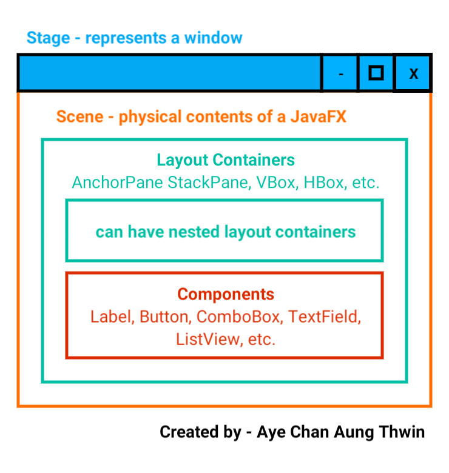

# JavaFX (Myanmar Unicode Font Fixed)
## အကျဥ်းချုပ်
> JFXအကြောင်းကို သိပြီးသားဆိုရင် MMUnicodeFixerကိုပဲ ယူသုံးလိုက်ရင်ရပါပြီ။

## About
- [X] JavaFXဆိုတာဘာလဲ? 
- [X] ဘယ်လိုအလုပ်လုပ်လဲ?
- [X] JavaFXကို ဘာလို့တိုက်ရိုက် မrunတာလဲ?
- [X] Text View Componentsတွေအတွက် မြန်မာယူနီကုဒ်ကို fixပြီးစီး
- [X] FYI

## JavaFXဆိုတာဘာလဲ?
- ကျွန်တော်တို့က JFXလို့လည်း ခေါ်တယ်။ Client-side applicationတွေအတွက် Design, Debug, Deployလုပ်ဖို့ပေါ့။ (အထူးသဖြင့် Desktop Developmentအတွက်ပေါ့။)

## ဘယ်လိုအလုပ်လုပ်လဲ?
- Componentsတွေက Layout Containersတွေထဲမှာရှိမယ်။ Layout Containerတွေထဲမှာလည်း Componentsတွေကို ထည့်ထားတဲ့ နောက်ထပ်containersတွေရှိမယ်။ (Nested Containersတွေပေါ့။) root layout containerကိုတော့ Sceneထဲကို ထည့်ပေးရမယ်။ Sceneဆိုတာက JavaFXမှာ မြင်ရဖို့ကို ပြပေးတဲ့အရာပေါ့။ ကျွန်တော်တို့က ဒါကို runလိုက်ပြီဆိုတာနဲ့ Window Frameလေးတက်လာမယ်။ အဲ့ဒါကို Stageလို့ခေါ်တယ်။ စတိတ်ရှိုးပွဲတွေဘာတွေ သွားဖူးတယ်မလား။ အဲ့လိုမျိုးပဲ။ ကျွန်တော်တို့ ကြည့်ရမယ့် Sceneကို Stageပေါ်ကိုတင်ပေးရတယ်။ အဲ့လိုပုံစံ အလုပ်လုပ်သွားတယ်။

## JavaFXကို ဘာလို့ တိုက်ရိုက် မrunတာလဲ?
- ကျွန်တော်တို့ တိုက်ရိုက် runလိုက်ရင် runတဲ့ main methodပါတဲ့ classက ```javafx.application.Application```ကနေ ဆင်းသက်လာတယ်ဆိုရင် runtimeမှာ component missing errorတက်မယ်။
- အဲ့ဒီerrorက ```java.base``` moduleထဲက ```sun.launcher.LauncherHelper```ကြောင့်ဖြစ်တာ။ အဲ့လို runလိုက်မယ်ဆိုရင် LauncherHelperက named moduleထဲမှာ ```javafx.graphics```ဆိုတဲ့ moduleပါမပါကြည့်မယ်။ မပါရင် launcherကို ပိတ်ပစ်လိုက်တယ်။
- Solutionကတော့ Applicationကို extendsလုပ်မထားတဲ့ class runပေါ့။
- ဒီissueကို ကျွန်တော်fixခဲ့တာမဟုတ်ပါဘူး။ ဒီlinkမှာ ဝင်ကြည့်ပါ။ -> https://stackoverflow.com/a/52571719
- ဒါပေမယ့် အဲ့ထဲကပဲ ကျွန်တော် ပြင်ထားတာရှိတယ်။ main methodပါတဲ့ Java classတိုင်းက စrunနိုင်တယ်။ အဲ့ဒါကြောင့် pom.xmlထဲမှာ အောက်ကcodeလေးကို ထည့်ပြီးတော့ ဘာကို စrunပါဆိုပြီး declareလုပ်ထားခဲ့တယ်။
```
<plugin>
	<groupId>org.openjfx</groupId>
	<artifactId>javafx-maven-plugin</artifactId>
	<version>0.0.5</version>
	<configuration>
        	<mainClass>com.acat.jfx.application.App</mainClass>
	</configuration>
</plugin>
```
- ပြီးတော့ Applicationတစ်ခုမှာ main method၂ခုမထားချင်ဘူး။ အဲ့ဒါနဲ့ JavaFXထဲမှာ String Array Argumentsတောင်းတဲ့ parameterပါတဲ့ static methodတစ်ခု createလုပ်ပြီး Appကနေ ပြန်ခေါ်လိုက်တယ်။

- ဒါကတော့ JavaFX။
```
public class JavaFX extends Application {

	@Override
	public void start(Stage primaryStage) throws Exception {
		//statements
		primaryStage.show();
	}

	public static void executeFx(String[] args) {
		launch(args);
	}
	
}
```
- ဒါကတော့ main methodပါတဲ့ class။ သူကနေမှ JavaFXကို runမှာ။
```
public class App {
	
    public static void main( String[] args ) {
        JavaFX.executeFx(args);
    }
}
```

## Text View Componentsတွေအတွက် မြန်မာယူနီကုဒ်ကို fixပြီးစီး
- ဒီ issueကိုလည်း ကျွန်တော် fixခဲ့တာမဟုတ်ဘူး။ အောက်မှာ ဝင်ဖတ်ကြည့်ပါ။
https://www.facebook.com/groups/javakits.ths/permalink/3288607697898151/ 
- ဒါကAndroidနဲ့ပတ်သက်တဲ့ similar issueပေါ့။ https://www.facebook.com/groups/javakits.ths/permalink/3594138190678432/

## FYI
- JavaFXကို SceneBuilderနဲ့ UIချသုံးလို့ recommendပေးပါတယ်။ ဒါပေမယ့် Javaကနေ Stageဆောက်ကို ဆောက်ပြီး သုံးရမယ့် အခြေအနေတွေလည်းရှိတယ်။

# Diagrams
- JavaFXဘယ်လို အလုပ်လုပ်သလဲ?


## Electronics Engineer-cum-J2EE Backend Developer ##
-  Created by - အေးချမ်းအောင်သွင်
